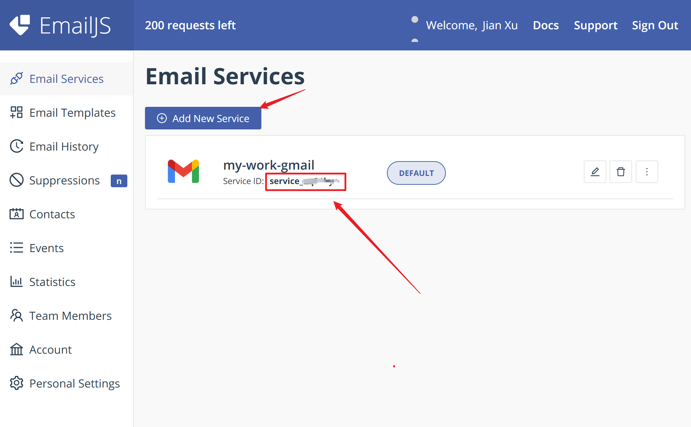
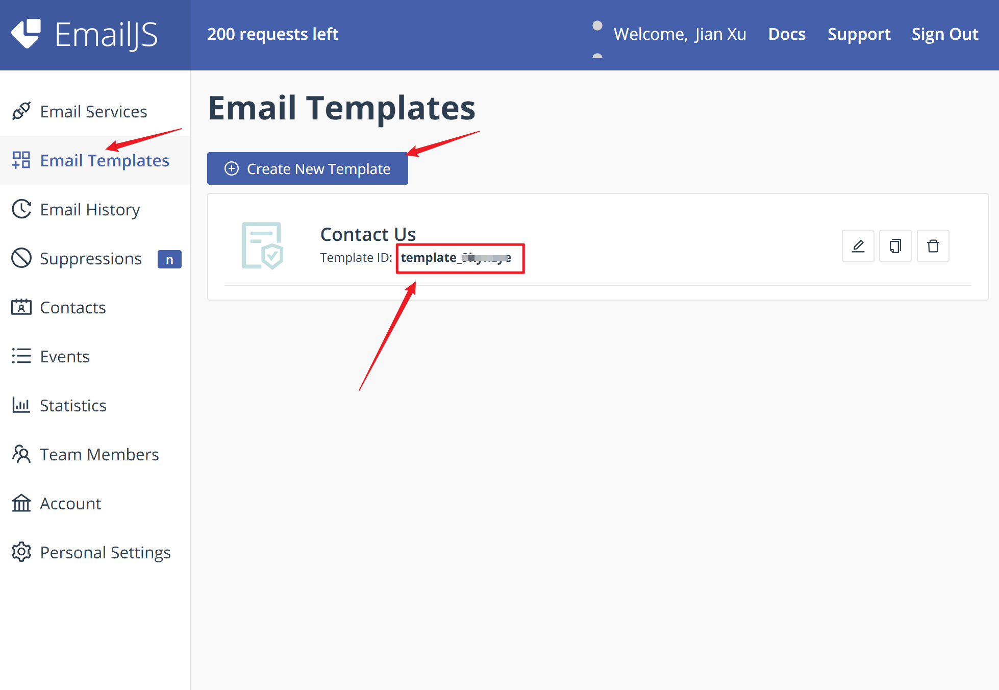
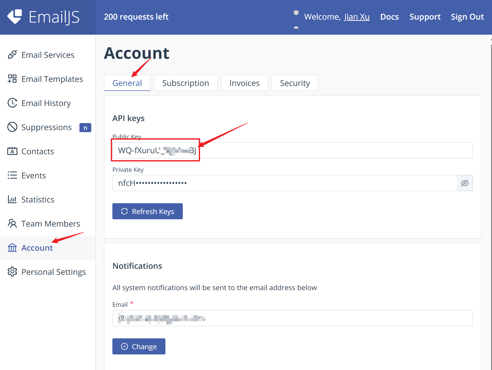

# EamilJS Tutorial

EmailJS enables **developers to send emails directly** from the client-side (browser) without the need for a dedicated backend. This guide covers setup, integration, testing, and troubleshooting for effectively using EmailJS in web development projects.


---

## 1. Overview

### Why Use EmailJS?

* **No backend server required**
* Compatible with **static websites**
* Supports major email providers (Gmail, Outlook, Yahoo, SMTP)
* Visual email template editor
* SDK and REST API provided

### Limitations

* Relies on external service and network stability
* Gmail requires OAuth and continuous authorization
* Not suited for high-frequency bulk emailing

---

## 2. Setup

### 2.1 Register & Log In

Visit [https://www.emailjs.com/](https://www.emailjs.com/) to create an account and access the dashboard.

### 2.2 Add Email Service

Navigate to **Email Services** → **Add Service** and choose:

* **Gmail** (OAuth authorization required)
* **Outlook / Yahoo**
* **SMTP** (custom domain email)
* **EmailJS Default** (recommended for testing)

>  **Note for Gmail**:
>
> * Use an account that supports OAuth
> * Avoid revoking or changing permissions after setup

### 2.3 Create Email Template

Go to **Email Templates** → **Create New Template**. Define the recipient, subject, and body using template variables:

```text
To: your_email@example.com
Subject: New message from ${name}
Body:
Hello, ${name} sent you a message:
${message}
```

### 2.4 Get Integration Info

In the **Integration** section, record the following:

| Parameter   | Purpose                        |
| ----------- | ------------------------------ |
| Service ID  | Identifies your email service  |
| Template ID | Identifies your email template |
| Public Key  | Used to initialize the SDK     |

#### Visual Reference:

To help locate your EmailJS integration information, see the screenshots below:

1. **Service ID Location**
   

2. **Template ID Location**
   

3. **Public Key Location**
   
---

## 3. Front-End Integration

### 3.1 Include SDK

####  For HTML (via CDN):
Include the following script tag in your HTML:
> important!!! please make sure you have the latest version of the script tag.
```html
<script src="https://cdn.jsdelivr.net/npm/@emailjs/browser@3/dist/email.min.js"></script>
```

### 3.2 Initialize SDK

```js
emailjs.init('your_Public_Key');
```

### 3.3 Send Email Example

#### Using `sendForm()`:

```html
<form id="contact-form">
  <input type="text" name="name" placeholder="Your Name" required />
  <textarea name="message" placeholder="Your Message" required></textarea>
  <button type="submit">Send</button>
</form>

<script>
  emailjs.init('your_Public_Key');

  document.getElementById('contact-form').addEventListener('submit', function (e) {
    e.preventDefault();
    emailjs.sendForm('your_Service_ID', 'your_Template_ID', this)
      .then(function(response) {
         alert('Success: ' + response.text);
      }, function(error) {
         alert('Failed: ' + error.text);
      });
  });
</script>
```

whole test `html` file:
```html
<!DOCTYPE html>
<html>
<head>
  <meta charset="UTF-8">
  <title>EmailJS 测试</title>
  <script src="https://cdn.jsdelivr.net/npm/@emailjs/browser@3/dist/email.min.js"></script>
  <script>
    (function(){
      emailjs.init("WQ-fXuruU_8gMsaBJ");
    })();

    function sendEmail(e) {
      e.preventDefault();
      emailjs.sendForm('service_uq31kyo', 'template_9kynzye', e.target)
        .then((result) => {
          alert('send sucessfully ' + result.text);
        }, (error) => {
          alert('error: ' + error.text);
        });
    }
  </script>
</head>
<body>
  <form onsubmit="sendEmail(event)">
    <input type="text" name="name" placeholder="输入你的名字" required /><br>
    <textarea name="message" placeholder="输入消息内容" required></textarea><br>
    <button type="submit">发送邮件</button>
  </form>
</body>
</html>

```


---

## 4. Common Issues & Solutions

| Issue                                        | Cause                                | Solution                                             |
| -------------------------------------------- | ------------------------------------ | ---------------------------------------------------- |
| `The Public Key is invalid`                  | Incorrect key or missing init call   | Ensure `emailjs.init(...)` is properly configured    |
| `Gmail_API: Request had insufficient scopes` | Gmail OAuth expired or misconfigured | Reconnect Gmail via Dashboard → Email Services       |
| Form unresponsive                            | JS error or event not bound          | Check console and ensure SDK is loaded correctly     |
| Email not received                           | Spam filter or template mismatch     | Check spam/junk folder and validate template content |

---

## 5. Best Practices

* Store public keys securely (e.g., in `.env` for frameworks)
* Use **EmailJS Default** service for initial testing
* Prefer `send()` method for fully customized payloads
* Use EmailJS Dashboard's **Email History** to debug sent emails

---

## 6. Resources

* EmailJS Website: [https://www.emailjs.com](https://www.emailjs.com)
* Documentation: [https://www.emailjs.com/docs/](https://www.emailjs.com/docs/)
* GitHub: [https://github.com/emailjs-com](https://github.com/emailjs-com)

---

