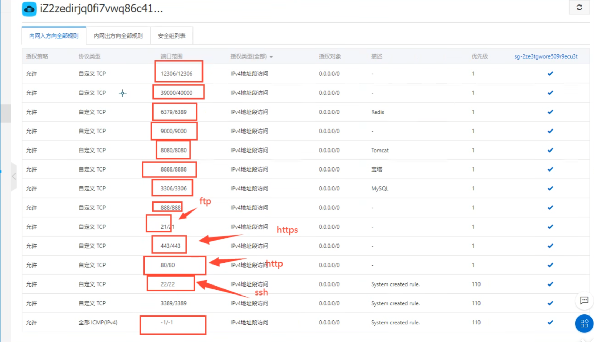
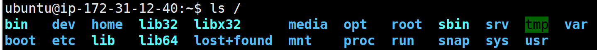
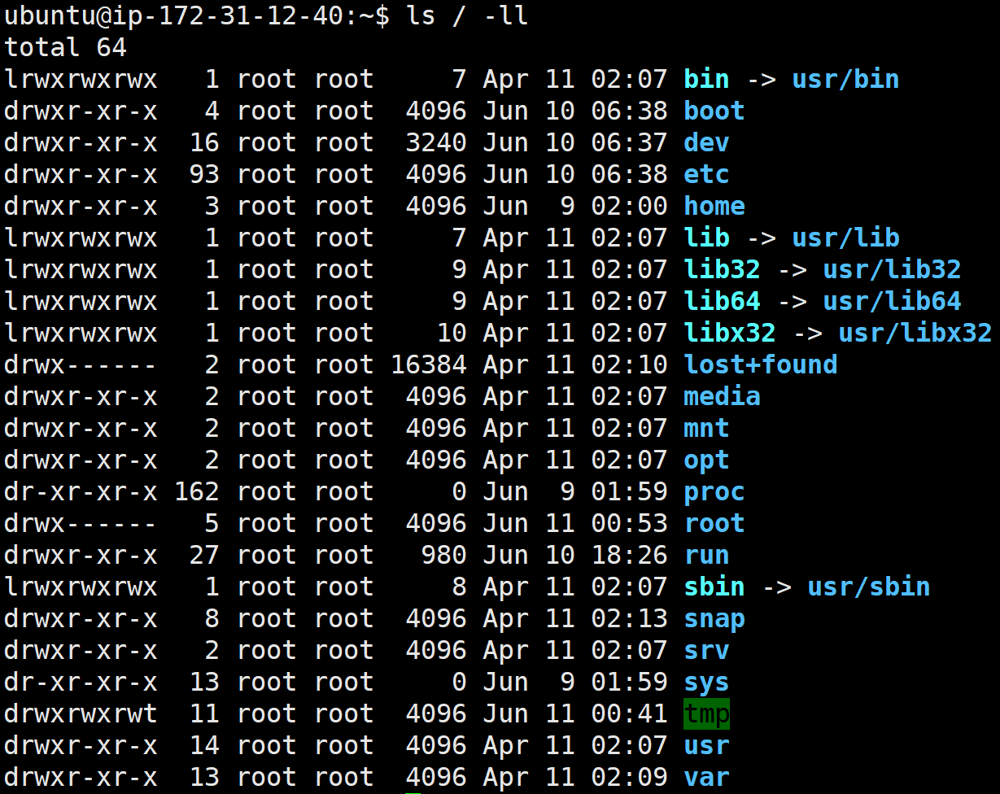
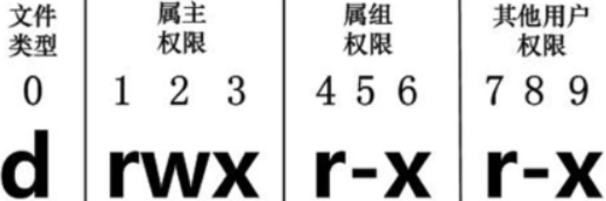
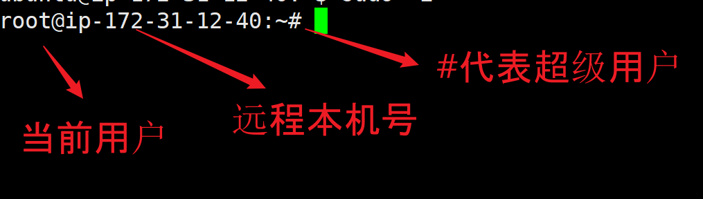
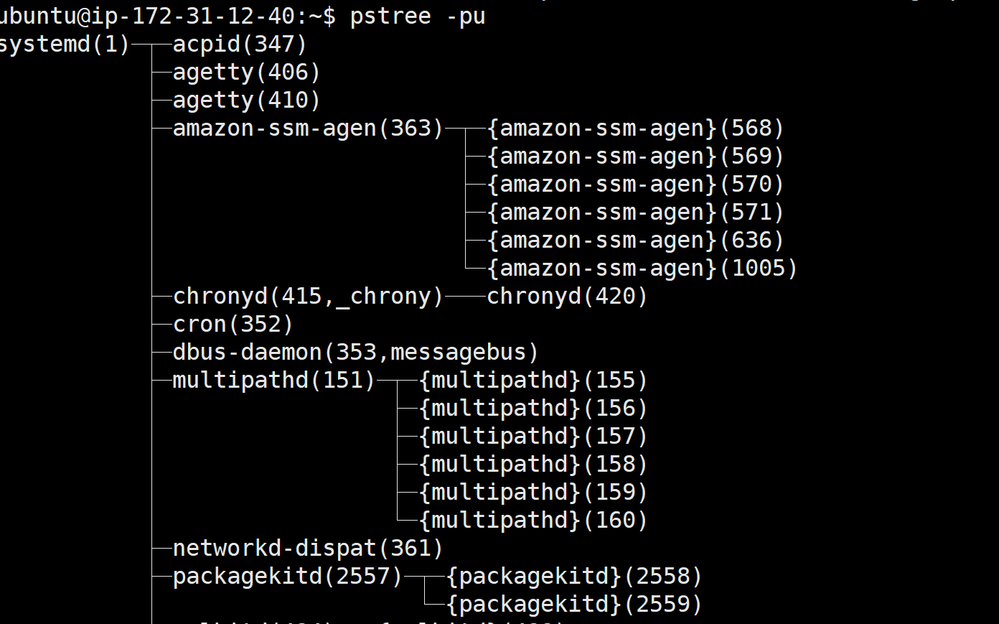

# Linux Instruction

## 系统的安装和设置


> 常用的开放端口号



授权对象0.0.0.0/0，表示所有人都可以访问

远程连接：默认用户是**ubuntu**, 或者**ec2-user**


## Linux基本操作

Linux中一切皆是文件

**<font color="red">文件:读写执行（查看，创建，删除，移动，复制，编辑），权限 （用户，用户组），系统（磁盘和进程）</font>**


> Linux 指令没有提示表示成功

不管是重启系统还是关闭系统，首先要运行 **sync** 命令，把内存中的数据写到磁盘中。

```plain
sync # 将数据由内存同步到硬盘中。

shutdown # 关机指令，你可以man shutdown 来看一下帮助文档。例如你可以运行如下命令关机：

reboot # 就是重启，等同于 shutdown –r now

halt # 关闭系统，等同于shutdown –h now 和 poweroff
```

树状目录结构：（Linux的一切资源都挂载在这个 / 根节点下）



**以下是对这些目录的解释：**

- **/bin**：bin是Binary的缩写, 这个目录存放着最经常使用的命令。
- **/boot：** 这里存放的是启动Linux时使用的一些核心文件，包括一些连接文件以及镜像文件。(不动)
- **/dev ：** dev是Device(设备)的缩写, 存放的是Linux的外部设备，在Linux中访问设备的方式和访问文件的方式是相同的。
- <font style="color: red;">**/etc：** 这个目录用来存放所有的系统管理所需要的配置文件和子目录。</font>
- <font color="red">**/home**：用户的主目录，在Linux中，每个用户都有一个自己的目录，一般该目录名是以用户的账号命名的。</font>
- **/lib**：这个目录里存放着系统最基本的动态连接共享库，其作用类似于Windows里的DLL文件。 (不动)
- **/lost+found**：这个目录一般情况下是空的，当系统非法关机后，这里就存放了一些文件。(不动)
- **/media**：linux系统会自动识别一些设备，例如U盘、光驱等等，当识别后，linux会把识别的设备挂载到这个目录下。
- **/mnt**：系统提供该目录是为了让用户临时挂载别的文件系统的，我们可以将光驱挂载在/mnt/上，然后进入该目录就可以查看光驱里的内容了。
- <font color="red">**/opt**：这是给主机额外安装软件所摆放的目录。比如你安装一个ORACLE数据库则就可以放到这个目录下。默认是空的。</font>
- **/proc**：这个目录是一个虚拟的目录，它是系统内存的映射，我们可以通过直接访问这个目录来获取系统信息。(不用管)
- <font color="red">**/root**：该目录为系统管理员，也称作超级权限者的用户主目录。</font>
- **/sbin**：s就是Super User的意思，这里存放的是系统管理员使用的系统管理程序。
- **/srv**：该目录存放一些服务启动之后需要提取的数据。
- **/sys**：这是linux2.6内核的一个很大的变化。该目录下安装了2.6内核中新出现的一个文件系统 sysfs 。
- <font color="red">**/tmp**：这个目录是用来存放一些临时文件的。</font >
- <font color="red">**/usr**：这是一个非常重要的目录，用户的很多应用程序和文件都放在这个目录下，类似于windows下的program files目录。</font>
- **/usr/bin：** 系统用户使用的应用程序。
- **/usr/sbin：** 超级用户使用的比较高级的管理程序和系统守护程序。
- **/usr/src：** 内核源代码默认的放置目录。
- <font color="red">**/var**：这个目录中存放着在不断扩充着的东西，我们习惯将那些经常被修改的目录放在这个目录下。包括各种日志文件。</font >
- **/run**：是一个临时文件系统，存储系统启动以来的信息。当系统重启时，这个目录下的文件应该被删掉或清除。
- <font color="red"> /www: 存放服务器网站相关的资源，环境，网站项目(需要后期自己安装)</font>

### 用户操作

切换超级用户

`sudo -i`

退出超级用户

`exit`


### 常用的基本命令

绝对路径就是以/ 开头

- ls: 列出目录
- cd：切换目录
- pwd：显示目前的目录
- mkdir：创建一个新的目录
- rmdir：删除一个**空的目录**
- cp: 复制文件或目录
- rm: 移除文件或目录
- mv: 移动文件与目录，或修改文件与目录的名称

> ls选项与参数：

- -a ：全部的文件，连同隐藏文件( 开头为 . 的文件) 一起列出来(常用)
- -l ：长数据串列出，包含文件的属性与权限等等数据；(常用)

将目录下的所有文件列出来(含属性与隐藏档)

`root@ip-172-31-12-40:/# ls -al`


> mkdir选项与参数：

- -m ：配置文件的权限喔！直接配置，不需要看默认权限 (umask) 的脸色～
- -p ：帮助你直接将所需要的目录(包含上一级目录)递归创建起来！


> cp  复制文件或目录 

语法：`ubuntu@ip-172-31-12-40:~$ cp [options] source1 source2 source3 .... directory`

选项与参数：

- **-a：**相当於 -pdr 的意思，至於 pdr 请参考下列说明；(常用)

- **-p：**连同文件的属性一起复制过去，而非使用默认属性(备份常用)；

- **-d：**若来源档为连结档的属性(link file)，则复制连结档属性而非文件本身；

- **-r：**递归持续复制，用於目录的复制行为；(常用)

- **-f：**为强制(force)的意思，若目标文件已经存在且无法开启，则移除后再尝试一次；

- **-i：**若目标档(destination)已经存在时，在覆盖时会先询问动作的进行(常用)

- **-l：**进行硬式连结(hard link)的连结档创建，而非复制文件本身。

- **-s：**复制成为符号连结档 (symbolic link)，亦即『捷径』文件；

- **-u：**若 destination 比 source 旧才升级 destination ！

  

>rm ( 移除文件或 目录 )  

语法`rm [-fir|rf] 文件或目录`

选项与参数：

- -f ：就是 force 的意思，忽略不存在的文件，不会出现警告信息；
- -i ：互动模式，在删除前会询问使用者是否动作
- -r ：递归删除啊！最常用在目录的删除了！这是非常危险的选项！！！


>mv  ( 移动文件与目录，或修改名称 )

语法：`mv [fiu] source destination`

- -f ：force 强制的意思，如果目标文件已经存在，不会询问而直接覆盖；
- -i ：若目标文件 (destination) 已经存在时，就会询问是否覆盖！
- -u ：若目标文件已经存在，且 source 比较新，才会升级 (update)

如果是同一个文件，可以表示重命名`mv test mvtest`


### 基本属性



实例中，boot文件的第一个属性用"d"表示。"d"在Linux中代表该文件是一个目录文件。

在Linux中第一个字符代表这个文件是目录、文件或链接文件等等：

- 当为[ **d** ]则是目录

- 当为[ **-** ]则是文件；

- 若是[ **l** ]则表示为链接文档 ( link file )；

- 若是[ **b** ]则表示为装置文件里面的可供储存的接口设备 ( 可随机存取装置 )；

- 若是[ **c** ]则表示为装置文件里面的串行端口设备，例如键盘、鼠标 ( 一次性读取装置 )。

  

接下来的字符中，以三个为一组，且均为『rwx』 的三个参数的组合。

其中，[ r ]代表可读(read)、[ w ]代表可写(write)、[ x ]代表可执行(execute)。

要注意的是，这三个权限的位置不会改变，如果没有权限，就会出现减号[ - ]而已。

每个文件的属性由左边第一部分的10个字符来确定

从左至右用0-9这些数字来表示。

第0位确定文件类型，第1-3位确定属主（该文件的所有者）拥有该文件的权限。第4-6位确定属组（所有者的同组用户）拥有该文件的权限，第7-9位确定其他用户拥有该文件的权限。

其中：

第1、4、7位表示读权限，如果用"r"字符表示，则有读权限，如果用"-"字符表示，则没有读权限；

第2、5、8位表示写权限，如果用"w"字符表示，则有写权限，如果用"-"字符表示没有写权限；

第3、6、9位表示可执行权限，如果用"x"字符表示，则有执行权限，如果用"-"字符表示，则没有执行权限。

对于文件来说，它都有一个特定的所有者，也就是对该文件具有所有权的用户。【属主】

同时，在Linux系统中，用户是按组分类的，一个用户属于一个或多个组。【属组，用户组】

**1、chgrp：更改文件属组**

```bash
chgrp [-R] 属组名 文件名
```

-R：递归更改文件属组，就是在更改某个目录文件的属组时，如果加上-R的参数，那么该目录下的所有文件的属组都会更改。

**2、chown：更改文件属主，也可以同时更改文件属组**

```bash
chown [–R] 属主名 文件名
chown [-R] 属主名：属组名 文件名
```

3、<font color="red">**chmod：更改文件9个属性**</font>

```bash
chmod [-R] xyz 文件或目录
```

Linux文件属性有两种设置方法，一种是数字，一种是符号。

Linux文件的基本权限就有九个，分别是owner/group/others三种身份各有自己的read/write/execute权限。

文件的权限字符为：『-rwxrwxrwx』， 这九个权限是三个三个一组的！其中，我们可以使用数字来代表各个权限，各权限的分数对照表如下：

```bash
r:4     w:2         x:1
```

每种身份(owner/group/others)各自的三个权限(r/w/x)分数是需要累加的，例如当权限为：[-rwxrwx---] 分数则是：

- owner = rwx = 4+2+1 = 7
- group = rwx = 4+2+1 = 7
- others= --- = 0+0+0 = 0

```bash
chmod 770 filename
```


### 文件内容查看

Linux系统中使用以下命令来查看文件的内容：

- cat 由第一行开始显示文件内容
- tac 从最后一行开始显示，可以看出 tac 是 cat 的倒着写！
- nl  显示的时候，顺道输出行号！
- more 一页一页的显示文件内容
- less 与 more 类似，但是比 more 更好的是，他可以往前翻页！
- head 只看头几行
- tail 只看尾巴几行

可以使用 *man [命令]*来查看各个命令的使用文档，如 ：man cat。

> cat 由第一行开始显示文件内容

语法：`cat [filename]`

选项与参数：

- -A ：相当於 -vET 的整合选项，可列出一些特殊字符而不是空白而已；
- -b ：列出行号，仅针对非空白行做行号显示，空白行不标行号！
- -E ：将结尾的断行字节 $ 显示出来；
- -n ：列印出行号，连同空白行也会有行号，与 -b 的选项不同；
- -T ：将 [tab] 按键以 ^I 显示出来；
- -v ：列出一些看不出来的特殊字符

> tac

tac与cat命令刚好相反，文件内容从最后一行开始显示，可以看出 tac 是 cat 的倒着写！如：

> nl  显示行号

语法：

```bash
nl [-bnw] 文件
```

选项与参数：

- -b ：指定行号指定的方式，主要有两种：-b a ：表示不论是否为空行，也同样列出行号(类似 cat -n)；-b t ：如果有空行，空的那一行不要列出行号(默认值)；
- -n ：列出行号表示的方法，主要有三种：-n ln ：行号在荧幕的最左方显示；-n rn ：行号在自己栏位的最右方显示，且不加 0 ；-n rz ：行号在自己栏位的最右方显示，且加 0 ；
- -w ：行号栏位的占用的位数。

> more  一页一页翻动

在 more 这个程序的运行过程中，你有几个按键可以按的：

- 空白键 (space)：代表向下翻一页；
- Enter   ：代表向下翻『一行』；
- /字串   ：代表在这个显示的内容当中，向下搜寻『字串』这个关键字；
- :f    ：立刻显示出档名以及目前显示的行数；
- q    ：代表立刻离开 more ，不再显示该文件内容。
- b 或 [ctrl]-b ：代表往回翻页，不过这动作只对文件有用，对管线无用。

> less  一页一页翻动，以下实例输出/etc/man.config文件的内容：

less运行时可以输入的命令有：

- 空白键  ：向下翻动一页；
- [pagedown]：向下翻动一页；
- [pageup] ：向上翻动一页；
- /字串  ：向下搜寻『字串』的功能；
- ?字串  ：向上搜寻『字串』的功能；
- n   ：重复前一个搜寻 (与 / 或 ? 有关！)
- N   ：反向的重复前一个搜寻 (与 / 或 ? 有关！)
- q   ：离开 less 这个程序；

> head  取出文件前面几行

语法：

```bash
head [-n number] 文件
```

选项与参数：**-n** 后面接数字，代表显示几行的意思！

> tail  取出文件后面几行

语法：

```bash
tail [-n number] 文件
```

选项与参数：

- -n ：后面接数字，代表显示几行的意思


**硬链接和软链接**

**硬链接**：A 是 B 的硬链接（A 和 B 都是文件名），则 A 的目录项中的 inode 节点号与 B 的目录项中的 inode 节点号相同，即一个 inode 节点对应两个不同的文件名，两个文件名指向同一个文件，A 和 B 对文件系统来说是完全平等的。删除其中任何一个都不会影响另外一个的访问。

**软连接**：symbolic Link, 类似于windows的快捷方式。

测试：

```bash
ubuntu@ip-172-31-12-40:~$ touch f1   # 创建f1
ubuntu@ip-172-31-12-40:~$ ls
apache-tomcat-10.1.7  apache-tomcat-10.1.7-windows-x64.zip  f1
ubuntu@ip-172-31-12-40:~$ ln f1 f2   #硬链接f1 f2
ubuntu@ip-172-31-12-40:~$ ls
apache-tomcat-10.1.7  apache-tomcat-10.1.7-windows-x64.zip  f1  f2
ubuntu@ip-172-31-12-40:~$ ln -s f1 f3  #软链接f1 f3
ubuntu@ip-172-31-12-40:~$ ls
apache-tomcat-10.1.7  apache-tomcat-10.1.7-windows-x64.zip  f1  f2  f3
ubuntu@ip-172-31-12-40:~$ ls -li       # -i参数显示文件的inode节点信息
total 13520
258580 drwxr-xr-x 9 ubuntu ubuntu     4096 Feb 27  2023 apache-tomcat-10.1.7
258374 -rw-rw-r-- 1 ubuntu ubuntu 13838741 Jun  9 03:59 apache-tomcat-10.1.7-windows-x64.zip
258536 -rw-rw-r-- 2 ubuntu ubuntu        0 Jun 11 06:47 f1
258536 -rw-rw-r-- 2 ubuntu ubuntu        0 Jun 11 06:47 f2
289804 lrwxrwxrwx 1 ubuntu ubuntu        2 Jun 11 06:47 f3 -> f1
ubuntu@ip-172-31-12-40:~$ echo "I am f1 file" >>f1     # 将字符串输入到f1
ubuntu@ip-172-31-12-40:~$ cat f1
I am f1 file
ubuntu@ip-172-31-12-40:~$ cat f2
I am f1 file
ubuntu@ip-172-31-12-40:~$ cat f3
I am f1 file
ubuntu@ip-172-31-12-40:~$ rm -rf f1
ubuntu@ip-172-31-12-40:~$ cat f2
I am f1 file
ubuntu@ip-172-31-12-40:~$ cat f3
cat: f3: No such file or directory

```

### Vim编辑器

Vim是从 vi 发展出来的一个文本编辑器。代码补完、编译及错误跳转等方便编程的功能特别丰富，在程序员中被广泛使用。用来**常看内容，编辑内容，保存内容**

> 三种使用模式

基本上 vi/vim 共分为三种模式，分别是**命令模式（Command mode）**，**输入模式（Insert mode）**和**底线命令模式（Last line mode）**。这三种模式的作用分别是：

**命令模式：**

用户刚刚启动 vi/vim，便进入了命令模式。

此状态下敲击键盘动作会被Vim识别为命令，而非输入字符。比如我们此时按下i，并不会输入一个字符，i被当作了一个命令。

以下是常用的几个命令：

- **i** 切换到输入模式，以输入字符。
- **x** 删除当前光标所在处的字符。
- **:** 切换到底线命令模式，以在最底一行输入命令。

若想要编辑文本：启动Vim，进入了命令模式，按下i，切换到输入模式。

命令模式只有一些最基本的命令，因此仍要依靠底线命令模式输入更多命令。

**输入模式：**

在命令模式下按下`i`就进入了输入模式。

在输入模式中，可以使用以下按键：

- **字符按键以及Shift组合**，输入字符
- **ENTER**，回车键，换行
- **BACK SPACE**，退格键，删除光标前一个字符
- **DEL**，删除键，删除光标后一个字符
- **方向键**，在文本中移动光标
- **HOME**/**END**，移动光标到行首/行尾
- **Page Up**/**Page Down**，上/下翻页
- **Insert**，切换光标为输入/替换模式，光标将变成竖线/下划线
- **ESC**，退出输入模式，切换到命令模式

**底线命令模式**

在命令模式下按下:（英文冒号）就进入了底线命令模式。

底线命令模式可以输入单个或多个字符的命令，可用的命令非常多。

在底线命令模式中，基本的命令有（已经省略了冒号）：

- q 退出程序
- w 保存文件

按ESC键可随时退出底线命令模式。


#### Vim对文件的操作流程:

 vim 来建立一个名为 jianstudy.txt 的文件 `vim jianstudy.txt`

**按下 i 进入输入模式(也称为编辑模式)，开始编辑文字**

**按下 ESC 按钮回到一般模式**

好了，假设我已经按照上面的样式给他编辑完毕了，那么应该要如何退出呢？是的！没错！就是给他按下 **Esc** 这个按钮即可！马上你就会发现画面左下角的 – INSERT – 不见了！

在一般模式中按下 **:wq** 储存后离开 vim

> Vim 按键说明

除了上面简易范例的 i, Esc, :wq 之外，其实 vim 还有非常多的按键可以使用。

**第一部分：一般模式可用的光标移动、复制粘贴、搜索替换等**

| 移动光标的方法                     |                                                              |
| :--------------------------------- | ------------------------------------------------------------ |
| h 或 向左箭头键(←)                 | 光标向左移动一个字符                                         |
| j 或 向下箭头键(↓)                 | 光标向下移动一个字符                                         |
| k 或 向上箭头键(↑)                 | 光标向上移动一个字符                                         |
| l 或 向右箭头键(→)                 | 光标向右移动一个字符                                         |
| [Ctrl] + [f]                       | 屏幕『向下』移动一页，相当于 [Page Down]按键 (常用)          |
| [Ctrl] + [b]                       | 屏幕『向上』移动一页，相当于 [Page Up] 按键 (常用)           |
| [Ctrl] + [d]                       | 屏幕『向下』移动半页                                         |
| [Ctrl] + [u]                       | 屏幕『向上』移动半页                                         |
| +                                  | 光标移动到非空格符的下一行                                   |
| -                                  | 光标移动到非空格符的上一行                                   |
| <font color="red">n< space></font> | 那个 n 表示『数字』，例如 20 。按下数字后再按空格键，光标会向右移动这一行的 n 个字符。 |
| 0 或功能键[Home]                   | 这是数字『 0 』：移动到这一行的最前面字符处 (常用)           |
| $ 或功能键[End]                    | 移动到这一行的最后面字符处(常用)                             |
| H                                  | 光标移动到这个屏幕的最上方那一行的第一个字符                 |
| M                                  | 光标移动到这个屏幕的中央那一行的第一个字符                   |
| L                                  | 光标移动到这个屏幕的最下方那一行的第一个字符                 |
| G                                  | 移动到这个档案的最后一行(常用)                               |
| nG                                 | n 为数字。移动到这个档案的第 n 行。例如 20G 则会移动到这个档案的第 20 行(可配合 :set nu) |
| gg                                 | 移动到这个档案的第一行，相当于 1G 啊！(常用)                 |
| <font color="red">n< Enter></font> | n 为数字。光标向下移动 n 行(常用)                            |

| 搜索替换                       |                                                              |
| :----------------------------- | ------------------------------------------------------------ |
| <font color="red">/word</font> | 向光标之下寻找一个名称为 word 的字符串。例如要在档案内搜寻 vbird 这个字符串，就输入 /vbird 即可！(常用) |
| ?word                          | 向光标之上寻找一个字符串名称为 word 的字符串。               |
| <font color="red">n</font>     | 这个 n 是英文按键。代表重复前一个搜寻的动作。举例来说， 如果刚刚我们执行 /vbird 去向下搜寻 vbird 这个字符串，则按下 n 后，会向下继续搜寻下一个名称为 vbird 的字符串。如果是执行 ?vbird 的话，那么按下 n 则会向上继续搜寻名称为 vbird 的字符串！ |
| <font color="red">N</font>     | 这个 N 是英文按键。与 n 刚好相反，为『反向』进行前一个搜寻动作。例如 /vbird 后，按下 N 则表示『向上』搜寻 vbird 。 |

| 删除、复制与粘贴           |                                                              |
| :------------------------- | ------------------------------------------------------------ |
| x, X                       | 在一行字当中，x 为向后删除一个字符 (相当于 [del] 按键)， X 为向前删除一个字符(相当于 [backspace] 亦即是退格键) (常用) |
| nx                         | n 为数字，连续向后删除 n 个字符。举例来说，我要连续删除 10 个字符， 『10x』。 |
| dd                         | 删除游标所在的那一整行(常用)                                 |
| ndd                        | n 为数字。删除光标所在的向下 n 行，例如 20dd 则是删除 20 行 (常用) |
| d1G                        | 删除光标所在到第一行的所有数据                               |
| dG                         | 删除光标所在到最后一行的所有数据                             |
| d$                         | 删除游标所在处，到该行的最后一个字符                         |
| d0                         | 那个是数字的 0 ，删除游标所在处，到该行的最前面一个字符      |
| yy                         | 复制游标所在的那一行(常用)                                   |
| nyy                        | n 为数字。复制光标所在的向下 n 行，例如 20yy 则是复制 20 行(常用) |
| y1G                        | 复制游标所在行到第一行的所有数据                             |
| yG                         | 复制游标所在行到最后一行的所有数据                           |
| y0                         | 复制光标所在的那个字符到该行行首的所有数据                   |
| y$                         | 复制光标所在的那个字符到该行行尾的所有数据                   |
| p, P                       | p 为将已复制的数据在光标下一行贴上，P 则为贴在游标上一行！举例来说，我目前光标在第 20 行，且已经复制了 10 行数据。则按下 p 后， 那 10 行数据会贴在原本的 20 行之后，亦即由 21 行开始贴。但如果是按下 P 呢？那么原本的第 20 行会被推到变成 30 行。(常用) |
| J                          | 将光标所在行与下一行的数据结合成同一行                       |
| c                          | 重复删除多个数据，例如向下删除 10 行，[ 10cj ]               |
| <font color="red">u</font> | 复原前一个动作。(常用)                                       |
| [Ctrl]+r                   | 重做上一个动作。(常用)                                       |

**第二部分：一般模式切换到编辑模式的可用的按钮说明**

| 进入输入或取代的编辑模式       |                                                              |
| :----------------------------- | ------------------------------------------------------------ |
| <font color="red">i, I</font>  | 进入输入模式(Insert mode)：i 为『从目前光标所在处输入』， I 为『在目前所在行的第一个非空格符处开始输入』。(常用) |
| a, A                           | 进入输入模式(Insert mode)：a 为『从目前光标所在的下一个字符处开始输入』， A 为『从光标所在行的最后一个字符处开始输入』。(常用) |
| o, O                           | 进入输入模式(Insert mode)：这是英文字母 o 的大小写。o 为『在目前光标所在的下一行处输入新的一行』；O 为在目前光标所在处的上一行输入新的一行！(常用) |
| r, R                           | 进入取代模式(Replace mode)：r 只会取代光标所在的那一个字符一次；R会一直取代光标所在的文字，直到按下 ESC 为止；(常用) |
| <font color="red">[Esc]</font> | 退出编辑模式，回到一般模式中(常用)                           |

**第三部分：一般模式切换到指令行模式的可用的按钮说明**

| 指令行的储存、离开等指令                                     |                                                              |
| :----------------------------------------------------------- | ------------------------------------------------------------ |
| :w                                                           | 将编辑的数据写入硬盘档案中(常用)                             |
| :w!                                                          | 若文件属性为『只读』时，强制写入该档案。不过，到底能不能写入， 还是跟你对该档案的档案权限有关啊！ |
| :q                                                           | 离开 vi (常用)                                               |
| :q!                                                          | 若曾修改过档案，又不想储存，使用 ! 为强制离开不储存档案。    |
| 注意一下啊，那个惊叹号 (!) 在 vi 当中，常常具有『强制』的意思～ |                                                              |
| <font color="red">:wq</font>                                 | 储存后离开，若为 :wq! 则为强制储存后离开 (常用)              |
| ZZ                                                           | 这是大写的 Z 喔！若档案没有更动，则不储存离开，若档案已经被更动过，则储存后离开！ |
| :w [filename]                                                | 将编辑的数据储存成另一个档案（类似另存新档）                 |
| :r [filename]                                                | 在编辑的数据中，读入另一个档案的数据。亦即将 『filename』 这个档案内容加到游标所在行后面 |
| :n1,n2 w [filename]                                          | 将 n1 到 n2 的内容储存成 filename 这个档案。                 |
| :! command                                                   | 暂时离开 vi 到指令行模式下执行 command 的显示结果！例如 『:! ls /home』即可在 vi 当中看 /home 底下以 ls 输出的档案信息！ |
| <font color="red">:set nu</font>                             | 显示行号，设定之后，会在每一行的前缀显示该行的行号           |
| :set nonu                                                    | 与 set nu 相反，为取消行号！                                 |

### 账号管理

Linux系统是一个多用户多任务的分时操作系统，任何一个要使用系统资源的用户，都必须首先向系统管理员申请一个账号，然后以这个账号的身份进入系统。



实现用户账号的管理，要完成的工作主要有如下几个方面：

- 用户账号的添加、删除与修改。
- 用户口令的管理。
- 用户组的管理。

> 用户账号的管理

用户账号的管理工作主要涉及到用户账号的添加、修改和删除。

添加用户账号就是在系统中创建一个新账号，然后为新账号分配用户号、用户组、主目录和登录Shell等资源。

> 添加账号 useradd ( sudo adduser 更加用户友好)

```bash
useradd 选项 用户名
```

参数说明：

- 选项 :
  - -c comment 指定一段注释性描述。
  - -d 目录 指定用户主目录，如果此目录不存在，则同时使用-m选项，可以创建主目录。
  - -g (group)：指定用户的初始组（primary group）。每个用户只能有一个初始组。
  - -G (groups)：指定用户的附加组（supplementary groups）。用户可以属于多个附加组。
  - -m　使用者目录如不存在则自动建立。
  - -s Shell文件 指定用户的登录Shell。
  - -u 用户号 指定用户的用户号，如果同时有-o选项，则可以重复使用其他用户的标识号。
- 用户名 :
  - 指定新账号的登录名。

测试(需要是管理员root账户)

```bash
# 此命令创建了一个用户jianxu，其中-m选项用来为登录名jianxu产生一个主目录
root@ip-172-31-12-40:~# useradd -m jianxu
root@ip-172-31-12-40:~# ls /home/
jianxu  ubuntu
```

增加用户账号就是在/etc/passwd文件中为新用户增加一条记录，同时更新其他系统文件如/etc/shadow, /etc/group等。

> 删除帐号

如果一个用户的账号不再使用，可以从系统中删除。

删除用户账号就是要将/etc/passwd等系统文件中的该用户记录删除，必要时还删除用户的主目录。

删除一个已有的用户账号使用userdel命令，其格式如下：

```bash
userdel 选项 用户名
```

常用的选项是 **-r**，它的作用是把用户的主目录一起删除。

```bash
root@ip-172-31-12-40:/home/ubuntu# userdel -r jianxu
```

此命令删除用户jianxu在系统文件中（主要是/etc/passwd, /etc/shadow, /etc/group等）的记录，同时删除用户的主目录。

> 修改帐号

修改用户账号就是根据实际情况更改用户的有关属性，如用户号、主目录、用户组、登录Shell等。

修改已有用户的信息使用usermod命令，其格式如下：

```bash
usermod 选项 用户名
```

常用的选项包括-c, -d, -m, -g, -G, -s, -u以及-o等，这些选项的意义与useradd命令中的选项一样，可以为用户指定新的资源值。

例如：

```bash
# usermod -s /bin/ksh -d /home/z –g developer jianxu
```

此命令将用户jianxu的登录Shell修改为ksh，主目录改为/home/z，用户组改为developer。

> 用户口令的管理passwd

用户管理的一项重要内容是用户口令的管理。用户账号刚创建时没有口令，但是被系统锁定，无法使用，必须为其指定口令后才可以使用，即使是指定空口令。

指定和修改用户口令的Shell命令是passwd。超级用户可以为自己和其他用户指定口令，普通用户只能用它修改自己的口令。

命令的格式为：

```bash
passwd 选项 用户名
```

可使用的选项：

- -l 锁定口令，即禁用账号。
- -u 口令解锁。
- -d 使账号无口令。
- -f 强迫用户下次登录时修改口令。

如果默认用户名，则修改当前用户的口令。

例如，假设当前用户是jianxu，则下面的命令修改该用户自己的口令：

```bash
$ passwd
Old password:******
New password:*******
Re-enter new password:*******
```

如果是超级用户，可以用下列形式指定任何用户的口令：

```bash
# passwd jianxu
New password:*******
Re-enter new password:*******
```

普通用户修改自己的口令时，passwd命令会先询问原口令，验证后再要求用户输入两遍新口令，如果两次输入的口令一致，则将这个口令指定给用户；而超级用户为用户指定口令时，就不需要知道原口令。

为了系统安全起见，用户应该选择比较复杂的口令，例如最好使用8位长的口令，口令中包含有大写、小写字母和数字，并且应该与姓名、生日等不相同。

为用户指定空口令时，执行下列形式的命令：

```bash
# passwd -d kuangshen
```

此命令将用户 kuangshen的口令删除，这样用户 kuangshen下一次登录时，系统就不再允许该用户登录了。

passwd 命令还可以用 -l(lock) 选项锁定某一用户，使其不能登录，例如：

```bash
# passwd -l kuangshen
```


> Linux下如何切换用户

1.切换用户的命令为：su username 【username是你的用户名哦】

2.从普通用户切换到root用户，还可以使用命令：sudo su

3.在终端输入exit或logout或使用快捷方式ctrl+d，可以退回到原来用户，其实ctrl+d也是执行的exit命令

4.在切换用户时，如果想在切换用户之后使用新用户的工作环境，可以在su和username之间加-，例如：【su - root】

$表示普通用户

\#表示超级用户，也就是root用户


> 删除帐号

如果一个用户的账号不再使用，可以从系统中删除。

删除用户账号就是要将/etc/passwd等系统文件中的该用户记录删除，必要时还删除用户的主目录。

删除一个已有的用户账号使用userdel命令，其格式如下：

```bash
userdel 选项 用户名
```

常用的选项是 **-r**，它的作用是把用户的主目录一起删除。

```bash
# userdel -r jianxu
```

此命令删除用户jianxu在系统文件中（主要是/etc/passwd, /etc/shadow, /etc/group等）的记录，同时删除用户的主目录。

### 用户组管理

> 创建一个用户组

```bash
# 例如，创建一个名为 developers 的新组：
sudo groupadd developers
```

>删除已有的用户组

```bash
sudo groupdel developers
```

> 修改组信息

```bash
#将 developers 组重命名为 devteam：
sudo groupmod -n devteam developers
```

常用的选项有：

- -g GID 为用户组指定新的组标识号。
- -o 与-g选项同时使用，用户组的新GID可以与系统已有用户组的GID相同。
- -n新用户组 将用户组的名字改为新名字

> 切换组

如果一个用户同时属于多个用户组，那么用户可以在用户组之间切换，以便具有其他用户组的权限。

用户可以在登录后，使用命令newgrp切换到其他用户组，这个命令的参数就是目的用户组。例如：

```bash
$ newgrp root
```

这条命令将当前用户切换到root用户组，前提条件是root用户组确实是该用户的主组或附加组。

> 列出所有组

```bash
getent group
#或者直接查询文件
cat /etc/group
```

用户组的所有信息都存放在/etc/group文件中。

将用户分组是Linux 系统中对用户进行管理及控制访问权限的一种手段。

每个用户都属于某个用户组；一个组中可以有多个用户，一个用户也可以属于不同的组。

当一个用户同时是多个组中的成员时，在/etc/passwd文件中记录的是用户所属的主组，也就是登录时所属的默认组，而其他组称为附加组。

用户要访问属于附加组的文件时，必须首先使用newgrp命令使自己成为所要访问的组中的成员。

用户组的所有信息都存放在/etc/group文件中。此文件的格式也类似于/etc/passwd文件，由冒号(:)隔开若干个字段，这些字段有：

```bash
组名:口令:组标识号:组内用户列表
```

> 将用户添加到附加组

```bash
sudo usermod -aG groupname username
#例如，将用户 jian 添加到 developers 组：
sudo usermod -aG developers jian
```

> 将用户从一个组中删除

```bash
sudo gpasswd -d username groupname
#例如，将用户 jian 从 developers 组中删除：
sudo gpasswd -d jian developers
```

> 列出用户所属的所有组

```bash
groups username
#例如，查看用户 jian 所属的组：
groups jian
```


### 磁盘管理

> 概述

Linux磁盘管理好坏直接关系到整个系统的性能问题。

Linux磁盘管理常用命令为 df、du。

- df ：列出文件系统的整体磁盘使用量
- du：检查磁盘空间使用量

> **df**（显示文件系统磁盘空间使用情况）

```bash
Copy code
df -h
```

- `-h`：以人类可读的格式显示（例如，MB、GB）。

> **du**（显示目录或文件的磁盘使用情况）

```
sh
Copy code
du -h /path/to/directory
```

- 选项与参数：
  - -a ：列出所有的文件与目录容量，因为默认仅统计目录底下的文件量而已。
  - -h ：以人们较易读的容量格式 (G/M) 显示；
  - -s ：列出总量而已，而不列出每个各别的目录占用容量；
  - -S ：不包括子目录下的总计，与 -s 有点差别。
  - -k ：以 KBytes 列出容量显示；
  - -m ：以 MBytes 列出容量显示；

> 挂载和卸载文件系统

```bash
sudo mount /dev/sdXn /mnt

```

将分区挂载到 `/mnt` 目录。

挂载前确保目标目录存在，或者创建它

> **umount**（卸载文件系统） 

```bash
sudo umount /mnt
```

卸载挂载点 `/mnt`。


### 进程管理

在Linux,每一个程序对应着一个进程，进程分为前台和后台运行，服务一般是后台运行，程序都是前台

命令

**ps** 查看当前系统正在执行的各种进程信息

> ps -xx

- -a当前的进程
- -u 以用户的信息显示进程
- -x 显示后台运行进程的参数

```bash
# ps -aux 查看所有进程
ps -aux|grep mysql

# | 在Linux和类Unix系统中，|（管道）是一种用于将一个命令的输出作为另一个命令的输入的机制
# grep 查找符合条件的字符串
```

> pstree -pu

`pstree` 命令用于显示进程树，它以树形结构展示系统中所有进程的层次关系。使用 `-p` 和 `-u` 选项可以显示每个进程的 PID（进程ID）和 UID（用户ID）。以下是 `pstree -pu` 命令的详细说明及其输出示例。

`pstree -pu` 命令

- `-p`：显示每个进程的 PID。
- `-u`：显示每个进程的 UID。



以结合其他选项来获得更多信息：

- 显示特定用户的进程树：

  ```bash
  pstree -pu username
  ```

- 结合`grep`筛选特定进程：

  ```sh
  pstree -pu | grep sshd
  ```


> 杀掉进程

`kill -9 进程名` 可以使用 `-9` 选项强制终止

```bash
#如果普通的 kill 命令无法终止进程，可以使用 -9 选项强制终止。
kill -9 PID

```


## Linux常见问题

### 配置密码登录

在amazon ec2 instance里面，通常只有public\private key登录，密码默认关闭，但是我们可以开启

> 如果创建的是amazon-linux

默认用户是ec2-user

需要修改 `/etc/ssh/sshd_config`中的选项`PasswordAuthentication yes`

```bash
# 确认是root用户
[root@ip-172-31-13-135 ~]# sudo vim /etc/ssh/sshd_config # 进入sshd_config
[root@ip-172-31-13-135 ~]# sudo systemctl restart sshd  # 重启服务器

```

>如果创建的是ubuntu

默认用户是ubuntu

需要修改 `etc/ssh/sshd_config.d`  下面的一个独立文件，同样修改 `PasswordAuthentication yes`

```bash
root@ip-172-31-12-40:~# cd /etc/ssh/sshd_config.d
root@ip-172-31-12-40:/etc/ssh/sshd_config.d# ls
60-cloudimg-settings.conf
root@ip-172-31-12-40:/etc/ssh/sshd_config.d# cat 60-cloudimg-settings
PasswordAuthentication no
root@ip-172-31-12-40:/etc/ssh/sshd_config.d# vim 60-cloudimg-settings

root@ip-172-31-12-40:/etc/ssh/sshd_config.d# sudo systemctl restart
```

> 重新设置用户密码

```
sudo passwd ubuntu
```


> amazon-linux 2023

它更行了包管理工具

`dnf` 是一种新的包管理器，是 `yum` 的继任者。它们的关系和区别如下：

1. **背景**

- **`yum`**（Yellowdog Updater, Modified）是早期的 RPM 包管理器，用于 CentOS、RHEL、Amazon Linux 等发行版。
- **`dnf`**（Dandified YUM）是 `yum` 的下一代版本，最早由 Fedora 项目引入，现在是 Fedora 和 Amazon Linux 2023 等发行版的默认包管理工具。

2. **主要区别**

- **性能**：`dnf` 更高效、占用资源更少。它优化了软件包处理逻辑，比 `yum` 更快，尤其在处理大量包时表现明显。
- **依赖管理**：`dnf` 有更好的依赖管理算法，能更好地解决包之间的冲突。
- **包缓存**：`dnf` 更智能地处理包缓存，不会像 `yum` 一样缓存未完成的下载包，从而减少磁盘空间浪费。
- **插件和拓展性**：`dnf` 支持更多的插件和扩展功能，增强了功能的灵活性。

3. **命令上的兼容性**

虽然 `dnf` 和 `yum` 的底层实现不同，但大多数 `yum` 命令和选项在 `dnf` 中依然可用。例如，以下命令在 `dnf` 和 `yum` 中基本相同


## 软件安装

软件安装的三种方式

- rpm (JDK:在线发布一个springboot项目)
- 解压缩 （tomcat,启动并通过外网访问，发布网站）
- yum在线安装 （docker:直接安装运行跑起来docker就可以）

### JDK安装

1.下载JDK rpm, oracle 官网

2.安装java环境

```
# 检查当前系统是否存在java环境    java -version
# 如果有需要先卸载
# rpm -qa|grep jdk  # 检测jdk版本信息
# rpm -e --nodeps 【jdk_name】

# 卸载完后再安装JDK
# rpm -ivh rpm包


```

> 配置环境变量

`/etc/profile`

```text
JAVA_HOME=/usr/java/jdk1.8.0_202-amd64
CLASSPATH=$JAVA_HOME/lib:$JAVA_HOME/jre/lib
PATH=$JAVA_HOME/bin:$JAVA_HOME/jre/bin:$PATH
export PATH CLASSPATH JAVA_HOME
```

让这个配置文件生效`source /etc/profile`

`sudo sysctl -p` 和 `source` 一个配置文件的作用虽然都是应用配置文件的更改，但它们用于不同的文件类型，且具体作用有所不同。以下是它们的区别：

1. `sudo sysctl -p`

- **作用**：`sudo sysctl -p` 用于重新加载 **内核参数** 配置文件，通常是 `/etc/sysctl.conf`。
- **文件类型**：它主要适用于 `sysctl.conf` 文件，这个文件用于设置 Linux 内核参数（例如网络、虚拟内存等方面的系统级参数）。
- **工作原理**：`sysctl -p` 会读取 `/etc/sysctl.conf` 文件并应用其中的所有设置，将配置加载到内核。
- **示例**：比如设置 `vm.overcommit_memory=1` 后，使用 `sudo sysctl -p` 可以立即生效，而无需重启系统。

2. `source` 命令

- **作用**：`source` 命令用于在 **当前 shell 会话** 中执行配置文件的命令。常用于加载用户的环境变量和 shell 配置（例如 `.bashrc`、`.bash_profile` 等）。
- **文件类型**：适用于 shell 脚本或包含环境变量和命令的配置文件（如 `.bashrc`、`.profile` 等），而不是内核参数文件。
- **工作原理**：`source` 命令会逐行读取文件内容，并在当前 shell 会话中执行。这可以立即使环境变量或 shell 配置生效，而不需要重启或重新登录。
- **示例**：当你在 `.bashrc` 中添加新的环境变量后，使用 `source ~/.bashrc` 可以立即使更改生效。

总结

- **`sudo sysctl -p`**：用于加载内核参数配置文件 `/etc/sysctl.conf`，作用于系统内核。
- **`source`**：用于在当前 shell 会话中执行配置文件的命令，通常用于加载环境变量或 shell 配置文件。
