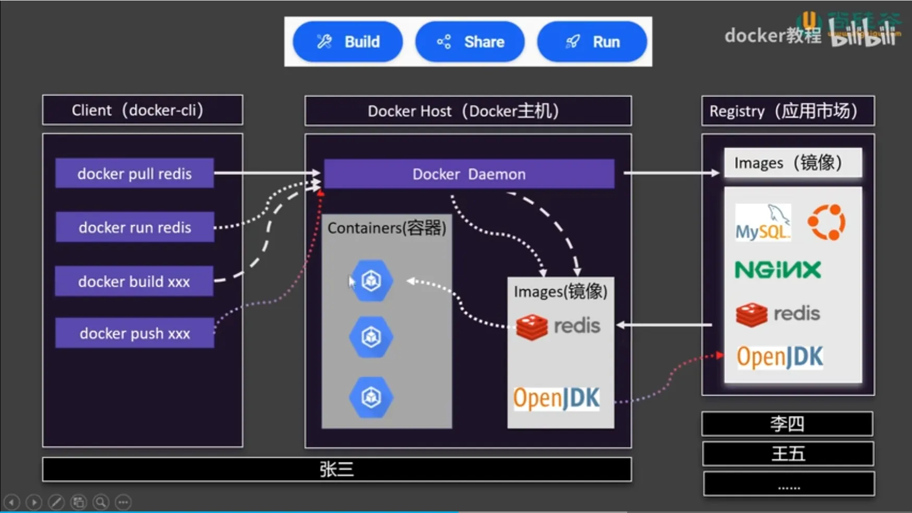

# Docker Basics and Application Deployment Guide

## Overview

[Docker](https://www.docker.com/) is a containerization platform that enables developers to package applications and their dependencies into isolated environments called containers. These containers are lightweight, portable, and consistent across development, staging, and production environments.

Docker Desktop Link: [https://www.docker.com/products/docker-desktop](https://www.docker.com/products/docker-desktop)



*Figure: Comparison between Docker Containers and Virtual Machines*

This document provides a comprehensive guide to Docker fundamentals and walks through the process of deploying a Python-based Dash data visualization application using Docker on a local Windows environment.

---

## Core Concepts

* **Image**: A static snapshot that contains all the files, environment variables, and configuration needed to run an application.
* **Container**: A running instance of a Docker image.
* **Dockerfile**: A script containing a set of instructions to assemble a Docker image.
* **Volume**: A mechanism for persistent data storage used by containers.
* **Docker Hub**: The default public registry for sharing Docker images.

---

## Essential Docker Commands

### System Info and Help

```bash
docker --version                # Display Docker version
docker info                    # Display system-wide information
docker help                    # Show help for Docker CLI
```

### Image Management

```bash
docker pull <image>            # Download image from Docker Hub
docker build -t myimage .      # Build image from Dockerfile in current directory
docker images                  # List local images
docker rmi <image_id>          # Delete a local image
```

### Container Lifecycle

```bash
docker run -d -p 8050:8050 myimage   # Run a container in detached mode with port mapping
docker ps                            # List running containers
docker ps -a                         # List all containers
docker stop <container_id>          # Stop a container
docker rm <container_id>            # Remove a container
```

### Utilities

```bash
docker exec -it <container_id> /bin/bash  # Start an interactive shell in the container
docker logs <container_id>               # View stdout/stderr logs
```

---

## Example: Deploying a Dash App Using Docker

This section demonstrates how to containerize and run a Dash data visualization application.

### Directory Structure

```
dash-app/
├── app.py
├── requirements.txt
└── Dockerfile
```

### app.py

```python
import dash
from dash import html

app = dash.Dash(__name__)
app.layout = html.Div(children=[html.H1("Hello from Dockerized Dash")])

if __name__ == '__main__':
    app.run_server(host='0.0.0.0', port=8050)
```

### requirements.txt

```
dash
```

### Dockerfile

```Dockerfile
# 使用官方 Python 镜像
FROM python:3.10-slim

# 设置容器内工作目录
WORKDIR /app

# 复制所有文件到容器中
COPY . .

# 安装依赖
RUN pip install --no-cache-dir -r requirements.txt   # requirements.txt contain Dash 依赖项和gunicorn(for docker container)

# 加载 .env 文件
ENV PYTHONUNBUFFERED=1

# 预定义端口
EXPOSE 8050

# 启动命令
CMD ["gunicorn", "app:server", "--bind", "0.0.0.0:8050", "--workers", "1"]
```

---

## Build and Run Workflow

### Step 1: Build the Docker Image

```bash
cd dash-app
docker build -t dash-container .
```

### Step 2: Run the Container

```bash
docker run -d --name dash-app -p 8050:8050 --restart=always dash-container
```

* `--name` gives the container a human-readable name
* `-p` maps port 8050 of the container to the host
* `--restart=always` ensures the container restarts on reboot

### Step 3: Verify Application Availability

Open a browser and navigate to:

```
http://localhost:8050
```

You should see the Dash UI indicating successful deployment.

```
# How to check info of a running container in docker

docker ps -a # List all containers, including stopped ones

docker inspect <container_id> # Display detailed information about a container

docker logs <container_id> # View the logs of a container

```


---

## Best Practices

* Use `.dockerignore` to exclude unnecessary files from your image build context
* Pin versions in `requirements.txt` to ensure deterministic builds
* Use tagged images (e.g., `myapp:1.0`) for version tracking
* Clean up unused images and containers using `docker system prune`
* Use Docker Compose for multi-container applications

---

## Summary

Docker is a powerful and versatile tool that simplifies application deployment by encapsulating runtime environments. By following the practices outlined in this guide, developers can reliably package and deploy Dash or any other web application across systems with consistent behavior and minimal configuration.
